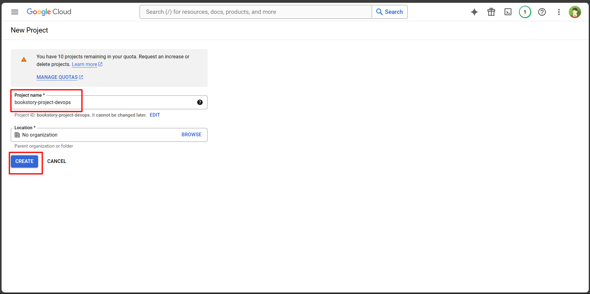
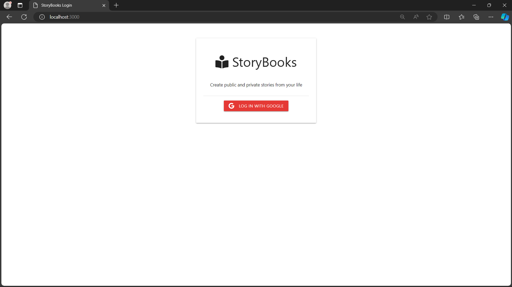

# StoryBooks (Dockerize and build pipeline)

Description: This app uses Node.js/Express/MongoDB with Google OAuth for authentication, using Docker, Terraform to build CI/CD pipeline

Source: clone from https://github.com/bradtraversy/storybooks

## Usage
- create .env file
    ```sh
    cp ./config/config.env.example ./config/config.env
    ```
- create google secret key
    - New project
        
    - OAuth
        
    - App name, email
        
    - Add authorize domail, Save and continue
        
    - Save and continue
        
    - Save and continue
        
    - Back to dashboard
        
    - Click Create Credentials ->  OAuth client ID
        
    - Add URI authorize Javascript origins, include: local, staging, production
        
    - Add URI authorize redirect uris, then click create
        
    - click copy id - secret, or download json, then click ok
        

- Add your mongoDB URI and Google OAuth credentials to the config.env file
    ```
    PORT = 3000
    MONGO_URI = mongodb://db:27017/storybooks
    GOOGLE_CLIENT_ID = <client id>
    GOOGLE_CLIENT_SECRET = <secret>
    ```

- build image if not exit
    ```sh
    docker build \
    --build-arg PORT=3000 \
	--build-arg MONGO_URI="mongodb://db:27017/storybooks" \
	--build-arg GOOGLE_CLIENT_ID="" \
	--build-arg GOOGLE_CLIENT_SECRET="" \
    -t storybooks-app:latest \  
    .
    ```

- run docker compose
    ```sh
    docker compose up -d
    ```

- result
    
    

- Create makefile with content below:
    ```
    run-local:
        docker compose up -d
    ```
- exec command with make:
    
    ```
    make run-local
    ```
## Terraform:
- Description: Using terraform to build infrastructure
- Docs in folder terraform: [here](./terraform/readme.md)

## Manual deploy
- From local machine, run this command to build docker image, ENV=[staging|production]
    ```sh
    make build MONGODB_PRIVATE_IP="" GOOGLE_CLIENT_ID="" GOOGLE_CLIENT_SECRET=""
    ```

- After build successfully, push image to docker hub, ENV=[staging|production]
    ```sh
    make push ENV="" DOCKERHUB_USERNAME=""
    ```

- deploy to AWS EC2 instance
    ```sh
    make deploy ENV="" EC2InstanceId="" DOCKERHUB_USERNAME="" 
    ```

- then go to domain management, point domain name to public ip of application instance
- result:
    
    

## Deploy with CI/CD github action
- result
    
    
    
